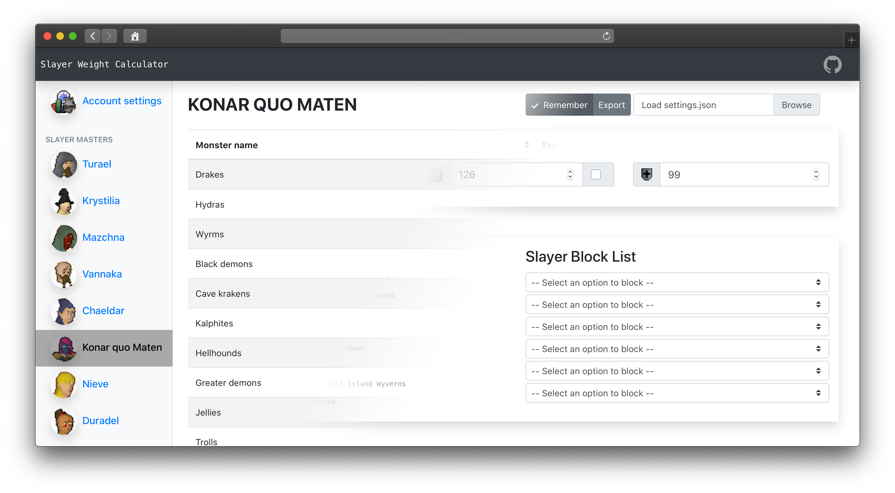

# Slayer Weight Calculator
[](https://bartvdbraak.github.io/SlayerWeightCalculator)
> A calculator for slayer geeks that need to know percentages. Reworked in VueJS.
***

The full application can be accessed at:

https://bartvdbraak.github.io/SlayerWeightCalculator

## Why VueJS?
This application was first written with little knowledge of the front-end Javascript landscape. Therefore, only jQuery and Datatables were used in conjunction with vanilla HTML and Bootstrap CSS. The codebase wasn't easily maintainable, making bugfixes or feature additions extremely tedious and time consuming.

The reactiveness and structure that is used in VueJS is alot easier to maintain and extend. Also, I just really wanted to learn more front-end javascript and it's very likely that many parts of the codebase can be improved.

## Why a static API?

This choice stems from the fact that I want users to be able to reach the application in Github pages. The application is meant for RuneScape players, which are (and should be) very hesitant to use tools that may compromise their account details. Therefor, the way to go was: an **open-source codebase** with all the **API endpoints stored** in JSON while the application can be reached by **Github Pages**.

## NPM Libraries

* `lodash` for filtering objects
* `bootstrap-vue` for reactive bootstrap components
* `vue-router` for navigation handling

## Project folder structure

```
.
+-- api/                    # python, csv, json files for API generate
+-- public/                 # beginning point for VueJS app (index)
+-- src/                    # files used by app
|   +-- assets/             # images
|   +-- components/         # vuejs components
|   +-- data/               # json endpoint files
|   +-- plugins/            # plugins (bootstrap-vue)
```

## Project setup
```
yarn install
```

### Compiles and hot-reloads for development
```
yarn serve
```

### Compiles and minifies for production
```
yarn build
```

### Lints and fixes files
```
yarn lint
```

## Github Pages Deploy
Clone the gh-pages branch (it uses a different `publicpath` module). 

Build dist folder:
```
yarn build
```
Remove old root build files 
```
rm -rf js img css index.html
```
Move new files to root.
```
rsync -a dist/* .
```
